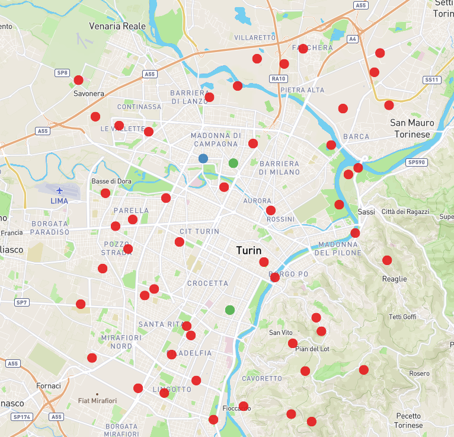

# Instances for the Periodic Vehicle Routing with Intermediate Facilities: Waste Collection
Case study and artificial Instances for the asymmetric periodic vehicle routing problems with intermediate facilities (PVRP-IF, [Angelelli and Speranza](https://doi.org/10.1016/S0377-2217(01)00206-5) ) designed according to the requirements of  a waste collection company.
Authors: [Francesco Taverna](https://dmif.uniud.it/it/didattica/dottorato/iai/dottorandi/francesco-taverna), [Christian Tilk](https://busan.univie.ac.at/members/members-of-research-group-prescriptive-business-analytics/ass-prof-dr-christian-tilk/).

## Naming Convention
The naming of the instances follows the scheme, *Area*\_*Number of customers*\_*Planning Horizon*\_*Instance number*, where the latter distinguishes between different instances that share the same number of customers and planning horizon. 

For example:  **`Milano_020_4_0.geojson`**  
- *Milano*: the area where the instance is located  
- *020*: the instance includes 20 customers  
- *4*: the planning horizon spans 4 days  
- *0*: this is the 0th instance among those with 20 customers and a 4-day planning horizon

## Structure of the instances
The data is organized in [GeoJson](https://it.wikipedia.org/wiki/GeoJSON) files, the info entry contains all the information required for the 
vehicles, e.g. size of the fleet, and the planning, e.g.  planning Horizon. The information on the nodes, i.e., depot, customers, and intermediate facilities, is within the features entry. 
Moreover, the travel time matrix ([[int]]) is stored in the duration entry,  and for the case study the adjacency matrix ([[bool]])  in the adjacency entry.
The travel time is the actual road time and is calculated by [OSRM](https://project-osrm.org/) using the [OSM](https://www.openstreetmap.org/)'s road layout. 

```json
{"type": "FeatureCollection",
 "info": { "numVehicles": 2, ...},
 "features": [
               {
                "id": "0",
                "type": "Feature",
                "properties": {"id": 0, "type": "depot",...},
                "geometry": {"type": "Point", "coordinates":[...]}
               },
              ...
]
"duration": [[....],[....],]
}
```
> **Note:**
> The coordinates of the customers in the case study are not provided, namely are all set equal to [0,0].

## To read the instances
It is recommended that the following libraries be used for the reading of the instances:
- C++: [nlohmann](https://github.com/nlohmann/json)
- Python: [json package](https://docs.python.org/3/library/json.html)

## To display the instances
To display the instances it is recommended to use the following library:
- Python: [geopandas](https://geopandas.org/en/stable/)
<p align="center"  >
  
  <figcaption>The figure illustrates one of the instances. The red dots represent the bins, while the blue and green dots represent the depot and intermediate facilities respectively.</figcaption>
</p>

## To generate new instances


## Best known solutions

The table below shows the results obtained for the novel instances with the MIP formulation and the Branch-Cut-and-Price Algorithm. The last two columns report the best upper and lower bounds obtained from the two methods. An asterisk next to an upper bound indicates that optimality has been proven for that instance.

<p align="center"  >
  <table border="1" class="dataframe">
    <thead>
      <tr>
        <th></th>
        <th colspan="2" halign="left">MIP</th>
        <th colspan="2" halign="left">BCP</th>
        <th colspan="2" halign="left">Best</th>
      </tr>
      <tr>
        <th>instance</th>
        <th>UB</th>
        <th>LB</th>
        <th>UB</th>
        <th>LB</th>
        <th>UB</th>
        <th>LB</th>
      </tr>
    </thead>
    <tbody>
      <tr>
        <th>Milano_020_4_0</th>
        <td>562.0</td>
        <td>525.0</td>
        <td>562.0</td>
        <td>562</td>
        <td>562*</td>
        <td>562.0</td>
      </tr>
      <tr>
        <th>Torino_020_4_1</th>
        <td>482.0</td>
        <td>463.0</td>
        <td>482.0</td>
        <td>482</td>
        <td>482*</td>
        <td>482.0</td>
      </tr>
      <tr>
        <th>Roma_020_4_2</th>
        <td>546.0</td>
        <td>475.0</td>
        <td>539.0</td>
        <td>545</td>
        <td>539</td>
        <td>545.0</td>
      </tr>
      <tr>
        <th>Milano_020_4_3</th>
        <td>661.0</td>
        <td>591.0</td>
        <td>657.0</td>
        <td>657</td>
        <td>657*</td>
        <td>657.0</td>
      </tr>
      <tr>
        <th>Torino_020_4_4</th>
        <td>574.0</td>
        <td>502.0</td>
        <td>557.0</td>
        <td>557</td>
        <td>557*</td>
        <td>557.0</td>
      </tr>
      <tr>
        <th>Roma_020_4_5</th>
        <td>487.0</td>
        <td>448.0</td>
        <td>482.0</td>
        <td>482</td>
        <td>482*</td>
        <td>482.0</td>
      </tr>
      <tr>
        <th>Milano_020_4_6</th>
        <td>609.0</td>
        <td>574.0</td>
        <td>609.0</td>
        <td>609</td>
        <td>609*</td>
        <td>609.0</td>
      </tr>
      <tr>
        <th>Torino_020_4_7</th>
        <td>614.0</td>
        <td>568.0</td>
        <td>613.0</td>
        <td>613</td>
        <td>613*</td>
        <td>613.0</td>
      </tr>
      <tr>
        <th>Roma_020_4_8</th>
        <td>426.0</td>
        <td>409.0</td>
        <td>426.0</td>
        <td>426</td>
        <td>426*</td>
        <td>426.0</td>
      </tr>
      <tr>
        <th>Milano_020_4_9</th>
        <td>538.0</td>
        <td>512.0</td>
        <td>538.0</td>
        <td>538</td>
        <td>538*</td>
        <td>538.0</td>
      </tr>
      <tr>
        <th>Milano_030_4_0</th>
        <td>628.0</td>
        <td>585.0</td>
        <td>621.0</td>
        <td>621</td>
        <td>621*</td>
        <td>621.0</td>
      </tr>
      <tr>
        <th>Torino_030_4_1</th>
        <td>681.0</td>
        <td>632.0</td>
        <td>673.0</td>
        <td>673</td>
        <td>673*</td>
        <td>673.0</td>
      </tr>
      <tr>
        <th>Roma_030_4_2</th>
        <td>547.0</td>
        <td>508.0</td>
        <td>543.0</td>
        <td>543</td>
        <td>543*</td>
        <td>543.0</td>
      </tr>
      <tr>
        <th>Milano_030_4_3</th>
        <td>723.0</td>
        <td>659.0</td>
        <td>713.0</td>
        <td>696</td>
        <td>713</td>
        <td>696.0</td>
      </tr>
      <tr>
        <th>Torino_030_4_4</th>
        <td>517.0</td>
        <td>483.0</td>
        <td>512.0</td>
        <td>512</td>
        <td>512*</td>
        <td>512.0</td>
      </tr>
      <tr>
        <th>Roma_030_4_5</th>
        <td>525.0</td>
        <td>491.0</td>
        <td>525.0</td>
        <td>525</td>
        <td>525*</td>
        <td>525.0</td>
      </tr>
      <tr>
        <th>Milano_030_4_6</th>
        <td>640.0</td>
        <td>596.0</td>
        <td>639.0</td>
        <td>639</td>
        <td>639*</td>
        <td>639.0</td>
      </tr>
      <tr>
        <th>Torino_030_4_7</th>
        <td>564.0</td>
        <td>536.0</td>
        <td>562.0</td>
        <td>562</td>
        <td>562*</td>
        <td>562.0</td>
      </tr>
      <tr>
        <th>Roma_030_4_8</th>
        <td>490.0</td>
        <td>454.0</td>
        <td>486.0</td>
        <td>486</td>
        <td>486*</td>
        <td>486.0</td>
      </tr>
      <tr>
        <th>Milano_030_4_9</th>
        <td>695.0</td>
        <td>646.0</td>
        <td>683.0</td>
        <td>676</td>
        <td>683</td>
        <td>676.0</td>
      </tr>
      <tr>
        <th>Milano_040_4_0</th>
        <td>628.0</td>
        <td>597.0</td>
        <td>621.0</td>
        <td>616</td>
        <td>621</td>
        <td>616.0</td>
      </tr>
      <tr>
        <th>Torino_040_4_1</th>
        <td>609.0</td>
        <td>564.0</td>
        <td>612.0</td>
        <td>595</td>
        <td>609</td>
        <td>595.0</td>
      </tr>
      <tr>
        <th>Roma_040_4_2</th>
        <td>592.0</td>
        <td>576.0</td>
        <td>591.0</td>
        <td>591</td>
        <td>591*</td>
        <td>591.0</td>
      </tr>
      <tr>
        <th>Milano_040_4_3</th>
        <td>590.0</td>
        <td>556.0</td>
        <td>573.0</td>
        <td>573</td>
        <td>573*</td>
        <td>573.0</td>
      </tr>
      <tr>
        <th>Torino_040_4_4</th>
        <td>646.0</td>
        <td>613.0</td>
        <td>645.0</td>
        <td>627</td>
        <td>645</td>
        <td>627.0</td>
      </tr>
      <tr>
        <th>Roma_040_4_5</th>
        <td>578.0</td>
        <td>525.0</td>
        <td>577.0</td>
        <td>557</td>
        <td>577</td>
        <td>557.0</td>
      </tr>
      <tr>
        <th>Milano_040_4_6</th>
        <td>751.0</td>
        <td>674.0</td>
        <td>737.0</td>
        <td>704</td>
        <td>737</td>
        <td>704.0</td>
      </tr>
      <tr>
        <th>Torino_040_4_7</th>
        <td>703.0</td>
        <td>629.0</td>
        <td>678.0</td>
        <td>668</td>
        <td>678</td>
        <td>668.0</td>
      </tr>
      <tr>
        <th>Roma_040_4_8</th>
        <td>555.0</td>
        <td>501.0</td>
        <td>552.0</td>
        <td>531</td>
        <td>552</td>
        <td>531.0</td>
      </tr>
      <tr>
        <th>Milano_040_4_9</th>
        <td>669.0</td>
        <td>633.0</td>
        <td>663.0</td>
        <td>652</td>
        <td>663</td>
        <td>652.0</td>
      </tr>
      <tr>
        <th>Milano_050_4_0</th>
        <td>817.0</td>
        <td>797.0</td>
        <td>816.0</td>
        <td>806</td>
        <td>816</td>
        <td>806.0</td>
      </tr>
      <tr>
        <th>Torino_050_4_1</th>
        <td>687.0</td>
        <td>629.0</td>
        <td>680.0</td>
        <td>644</td>
        <td>680</td>
        <td>644.0</td>
      </tr>
      <tr>
        <th>Roma_050_4_2</th>
        <td>697.0</td>
        <td>650.0</td>
        <td>695.0</td>
        <td>678</td>
        <td>695</td>
        <td>678.0</td>
      </tr>
      <tr>
        <th>Milano_050_4_3</th>
        <td>813.0</td>
        <td>770.0</td>
        <td>818.0</td>
        <td>789</td>
        <td>813</td>
        <td>789.0</td>
      </tr>
      <tr>
        <th>Torino_050_4_4</th>
        <td>638.0</td>
        <td>604.0</td>
        <td>638.0</td>
        <td>618</td>
        <td>638</td>
        <td>618.0</td>
      </tr>
      <tr>
        <th>Roma_050_4_5</th>
        <td>651.0</td>
        <td>577.0</td>
        <td>634.0</td>
        <td>595</td>
        <td>634</td>
        <td>595.0</td>
      </tr>
      <tr>
        <th>Milano_050_4_6</th>
        <td>735.0</td>
        <td>681.0</td>
        <td>727.0</td>
        <td>699</td>
        <td>727</td>
        <td>699.0</td>
      </tr>
      <tr>
        <th>Torino_050_4_7</th>
        <td>581.0</td>
        <td>568.0</td>
        <td>583.0</td>
        <td>577</td>
        <td>581</td>
        <td>577.0</td>
      </tr>
      <tr>
        <th>Roma_050_4_8</th>
        <td>637.0</td>
        <td>593.0</td>
        <td>632.0</td>
        <td>611</td>
        <td>632</td>
        <td>611.0</td>
      </tr>
      <tr>
        <th>Milano_050_4_9</th>
        <td>914.0</td>
        <td>808.0</td>
        <td>889.0</td>
        <td>847</td>
        <td>889</td>
        <td>847.0</td>
      </tr>
      <tr style="border-top: 2px solid white;">
        <td colspan="7"></td>
      </tr>
      <tr>
        <th>Milano_020_6_0</th>
        <td>953.0</td>
        <td>772.0</td>
        <td>911.0</td>
        <td>911</td>
        <td>911*</td>
        <td>911.0</td>
      </tr>
      <tr>
        <th>Torino_020_6_1</th>
        <td>588.0</td>
        <td>553.0</td>
        <td>588.0</td>
        <td>588</td>
        <td>588*</td>
        <td>588.0</td>
      </tr>
      <tr>
        <th>Roma_020_6_2</th>
        <td>552.0</td>
        <td>521.0</td>
        <td>551.0</td>
        <td>551</td>
        <td>551*</td>
        <td>551.0</td>
      </tr>
      <tr>
        <th>Milano_020_6_3</th>
        <td>884.0</td>
        <td>803.0</td>
        <td>884.0</td>
        <td>884</td>
        <td>884*</td>
        <td>884.0</td>
      </tr>
      <tr>
        <th>Torino_020_6_4</th>
        <td>790.0</td>
        <td>719.0</td>
        <td>775.0</td>
        <td>775</td>
        <td>775*</td>
        <td>775.0</td>
      </tr>
      <tr>
        <th>Roma_020_6_5</th>
        <td>839.0</td>
        <td>726.0</td>
        <td>833.0</td>
        <td>833</td>
        <td>833*</td>
        <td>833.0</td>
      </tr>
      <tr>
        <th>Milano_020_6_6</th>
        <td>786.0</td>
        <td>709.0</td>
        <td>780.0</td>
        <td>780</td>
        <td>780*</td>
        <td>780.0</td>
      </tr>
      <tr>
        <th>Torino_020_6_7</th>
        <td>594.0</td>
        <td>559.0</td>
        <td>587.0</td>
        <td>587</td>
        <td>587*</td>
        <td>587.0</td>
      </tr>
      <tr>
        <th>Roma_020_6_8</th>
        <td>760.0</td>
        <td>688.0</td>
        <td>758.0</td>
        <td>758</td>
        <td>758*</td>
        <td>758.0</td>
      </tr>
      <tr>
        <th>Milano_020_6_9</th>
        <td>751.0</td>
        <td>685.0</td>
        <td>726.0</td>
        <td>726</td>
        <td>726*</td>
        <td>726.0</td>
      </tr>
      <tr>
        <th>Milano_030_6_0</th>
        <td>1023.0</td>
        <td>830.0</td>
        <td>950.0</td>
        <td>934</td>
        <td>950</td>
        <td>934.0</td>
      </tr>
      <tr>
        <th>Torino_030_6_1</th>
        <td>837.0</td>
        <td>665.0</td>
        <td>772.0</td>
        <td>767</td>
        <td>772</td>
        <td>767.0</td>
      </tr>
      <tr>
        <th>Roma_030_6_2</th>
        <td>829.0</td>
        <td>716.0</td>
        <td>803.0</td>
        <td>780</td>
        <td>803</td>
        <td>780.0</td>
      </tr>
      <tr>
        <th>Milano_030_6_3</th>
        <td>871.0</td>
        <td>828.0</td>
        <td>871.0</td>
        <td>870</td>
        <td>871</td>
        <td>870.0</td>
      </tr>
      <tr>
        <th>Torino_030_6_4</th>
        <td>726.0</td>
        <td>668.0</td>
        <td>706.0</td>
        <td>706</td>
        <td>706*</td>
        <td>706.0</td>
      </tr>
      <tr>
        <th>Roma_030_6_5</th>
        <td>766.0</td>
        <td>691.0</td>
        <td>764.0</td>
        <td>733</td>
        <td>764</td>
        <td>733.0</td>
      </tr>
      <tr>
        <th>Milano_030_6_6</th>
        <td>979.0</td>
        <td>841.0</td>
        <td>962.0</td>
        <td>922</td>
        <td>962</td>
        <td>922.0</td>
      </tr>
      <tr>
        <th>Torino_030_6_7</th>
        <td>633.0</td>
        <td>572.0</td>
        <td>632.0</td>
        <td>611</td>
        <td>632</td>
        <td>611.0</td>
      </tr>
      <tr>
        <th>Roma_030_6_8</th>
        <td>679.0</td>
        <td>628.0</td>
        <td>677.0</td>
        <td>663</td>
        <td>677</td>
        <td>663.0</td>
      </tr>
      <tr>
        <th>Milano_030_6_9</th>
        <td>1195.0</td>
        <td>1102.0</td>
        <td>1196.0</td>
        <td>1188</td>
        <td>1195</td>
        <td>1188.0</td>
      </tr>
      <tr>
        <th>Milano_040_6_0</th>
        <td>1059.0</td>
        <td>916.0</td>
        <td>1036.0</td>
        <td>974</td>
        <td>1036</td>
        <td>974.0</td>
      </tr>
      <tr>
        <th>Torino_040_6_1</th>
        <td>873.0</td>
        <td>759.0</td>
        <td>856.0</td>
        <td>793</td>
        <td>856</td>
        <td>793.0</td>
      </tr>
      <tr>
        <th>Roma_040_6_2</th>
        <td>800.0</td>
        <td>699.0</td>
        <td>795.0</td>
        <td>756</td>
        <td>795</td>
        <td>756.0</td>
      </tr>
      <tr>
        <th>Milano_040_6_3</th>
        <td>978.0</td>
        <td>859.0</td>
        <td>969.0</td>
        <td>892</td>
        <td>969</td>
        <td>892.0</td>
      </tr>
      <tr>
        <th>Torino_040_6_4</th>
        <td>1103.0</td>
        <td>965.0</td>
        <td>1083.0</td>
        <td>1013</td>
        <td>1083</td>
        <td>1013.0</td>
      </tr>
      <tr>
        <th>Roma_040_6_5</th>
        <td>756.0</td>
        <td>634.0</td>
        <td>723.0</td>
        <td>668</td>
        <td>723</td>
        <td>668.0</td>
      </tr>
      <tr>
        <th>Milano_040_6_6</th>
        <td>1057.0</td>
        <td>966.0</td>
        <td>1052.0</td>
        <td>982</td>
        <td>1052</td>
        <td>982.0</td>
      </tr>
      <tr>
        <th>Torino_040_6_7</th>
        <td>992.0</td>
        <td>814.0</td>
        <td>951.0</td>
        <td>861</td>
        <td>951</td>
        <td>861.0</td>
      </tr>
      <tr>
        <th>Roma_040_6_8</th>
        <td>926.0</td>
        <td>824.0</td>
        <td>934.0</td>
        <td>870</td>
        <td>926</td>
        <td>870.0</td>
      </tr>
      <tr>
        <th>Milano_040_6_9</th>
        <td>1199.0</td>
        <td>1027.0</td>
        <td>1161.0</td>
        <td>1075</td>
        <td>1161</td>
        <td>1075.0</td>
      </tr>
      <tr>
        <th>Milano_050_6_0</th>
        <td>1155.0</td>
        <td>949.0</td>
        <td>1113.0</td>
        <td>990</td>
        <td>1113</td>
        <td>990.0</td>
      </tr>
      <tr>
        <th>Torino_050_6_1</th>
        <td>1041.0</td>
        <td>969.0</td>
        <td>1046.0</td>
        <td>993</td>
        <td>1041</td>
        <td>993.0</td>
      </tr>
      <tr>
        <th>Roma_050_6_2</th>
        <td>835.0</td>
        <td>655.0</td>
        <td>791.0</td>
        <td>698</td>
        <td>791</td>
        <td>698.0</td>
      </tr>
      <tr>
        <th>Milano_050_6_3</th>
        <td>951.0</td>
        <td>820.0</td>
        <td>931.0</td>
        <td>878</td>
        <td>931</td>
        <td>878.0</td>
      </tr>
      <tr>
        <th>Torino_050_6_4</th>
        <td>969.0</td>
        <td>855.0</td>
        <td>957.0</td>
        <td>897</td>
        <td>957</td>
        <td>897.0</td>
      </tr>
      <tr>
        <th>Roma_050_6_5</th>
        <td>822.0</td>
        <td>677.0</td>
        <td>799.0</td>
        <td>715</td>
        <td>799</td>
        <td>715.0</td>
      </tr>
      <tr>
        <th>Milano_050_6_6</th>
        <td>1193.0</td>
        <td>1035.0</td>
        <td>1167.0</td>
        <td>1069</td>
        <td>1167</td>
        <td>1069.0</td>
      </tr>
      <tr>
        <th>Torino_050_6_7</th>
        <td>882.0</td>
        <td>757.0</td>
        <td>868.0</td>
        <td>797</td>
        <td>868</td>
        <td>797.0</td>
      </tr>
      <tr>
        <th>Roma_050_6_8</th>
        <td>877.0</td>
        <td>737.0</td>
        <td>861.0</td>
        <td>771</td>
        <td>861</td>
        <td>771.0</td>
      </tr>
      <tr>
        <th>Milano_050_6_9</th>
        <td>1238.0</td>
        <td>1056.0</td>
        <td>1215.0</td>
        <td>1103</td>
        <td>1215</td>
        <td>1103.0</td>
      </tr>
    </tbody>
  </table>
</p>
